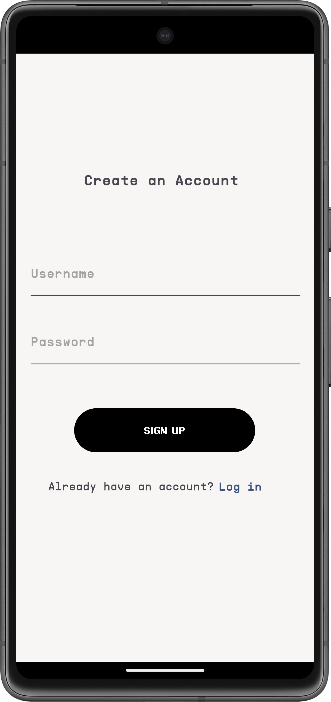
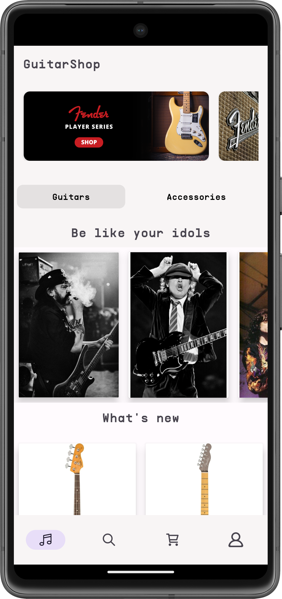
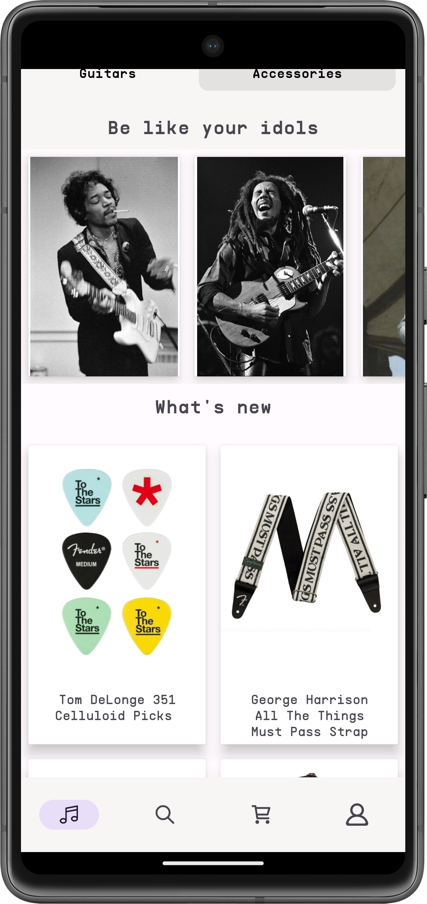
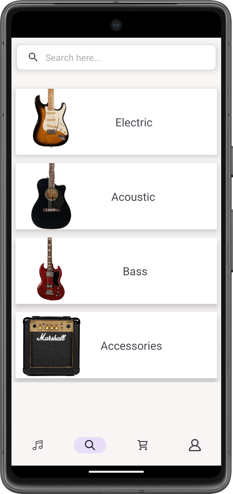
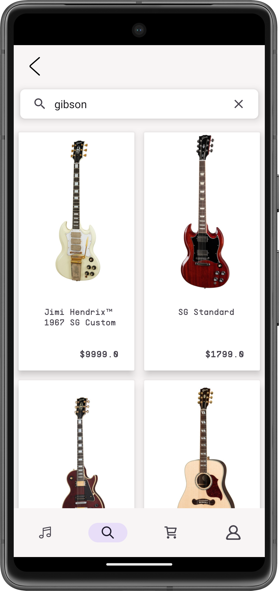
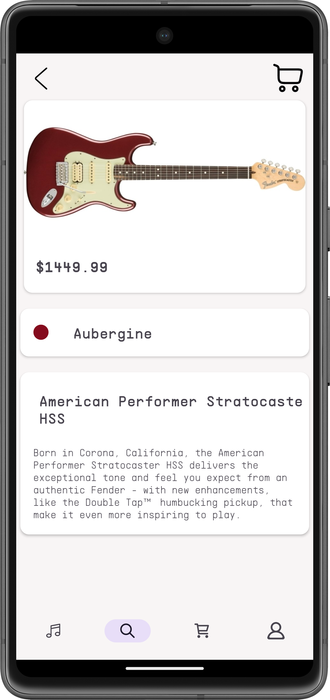
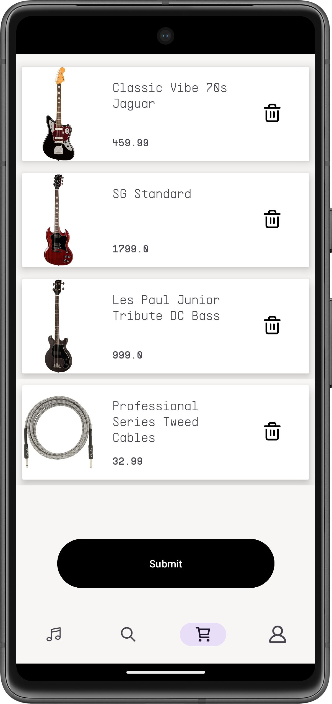
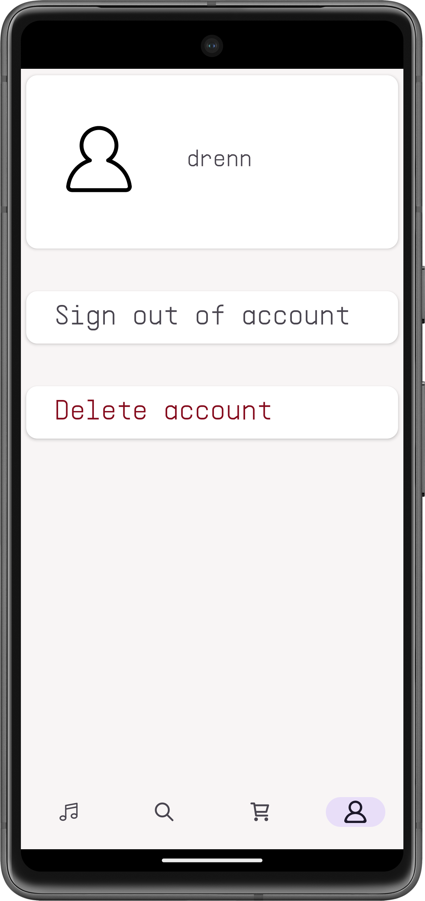

# GuitarShop
Приложение магазина гитар, использующее [ktor бэкенд](https://github.com/xdrenn/ktor-shop-backend) построенный с
+ MVVM
+ Coroutines/Coroutines Flow
+ Retrofit
+ Room
+ Navigation Component
+ StateFlow
+ Dagger Hilt
+ Picasso

# Screenshots

